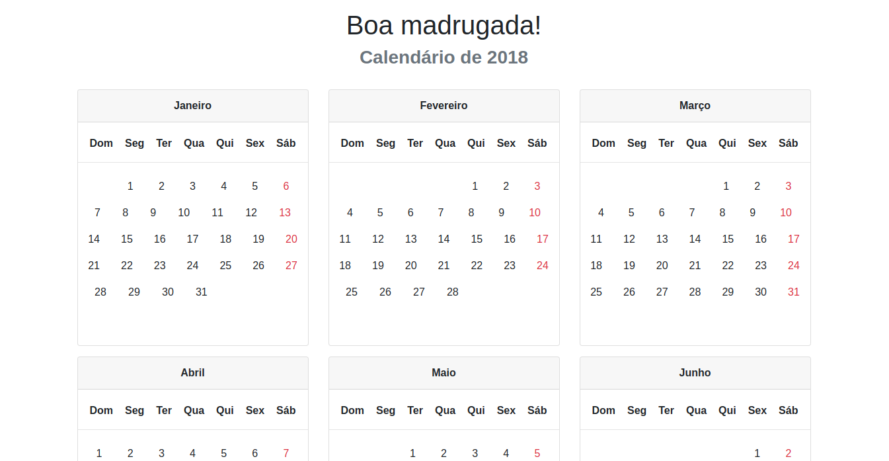

# calendariophp
Um calendário utilizando o PHP e bootstrap 4

# Funcionalidades
- Responsivo
- Todos os 12 meses do ano
- Domingos destacados
- Data atual em evidência

# Tecnologias
- Bootstrap 4
- PHP
- HTML5

